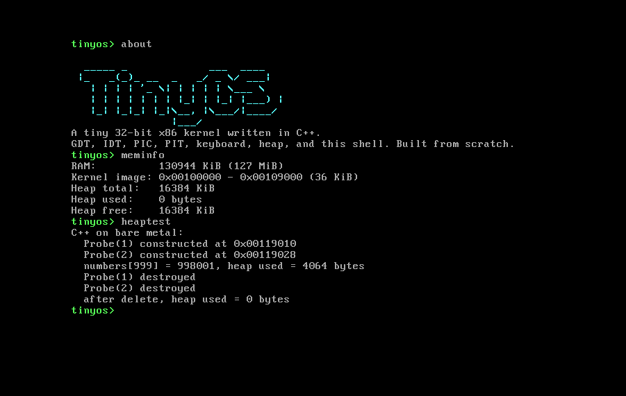

# TinyOS

A tiny 32-bit x86 operating system kernel written from scratch in **C++17** and a little NASM assembly.
It boots (via GRUB/Multiboot or straight in QEMU), sets up the CPU, handles interrupts, manages memory,
and drops you into an interactive shell.

<!-- Add a screenshot or GIF of TinyOS running in QEMU here: -->


## Features

- Multiboot entry point in assembly, kernel stack, jump into C++ (`kernel_main`)
- **GDT** (flat memory model) and **IDT** with 48 interrupt stubs
- Readable **kernel panic screen** for CPU exceptions (registers, error code, CR2 on page faults)
- **PIC** remapping, **PIT** timer at 100 Hz (`uptime`, `sleep`)
- **PS/2 keyboard** driver (shift, caps lock, ring buffer, blocking `getchar`)
- **VGA text driver** with colors, scrolling, hardware cursor, plus **serial (COM1)** logging
- Bootloader **memory map** parsing
- **Kernel heap** (first-fit allocator with block splitting/coalescing and corruption checks)
- Real C++ on bare metal: `operator new/delete`, constructors/destructors, global constructors
- **Shell** with line editing and 13 commands
- Freestanding `libc` bits (`memcpy`, `strlen`, `kprintf`, ...) written from scratch
- GitHub Actions CI that builds the kernel and boot-tests it in headless QEMU

## Build and run

### Ubuntu / Debian / WSL

```bash
sudo apt update
sudo apt install build-essential g++-multilib nasm qemu-system-x86 \
                 grub-pc-bin grub-common xorriso mtools

make          # build build/kernel.elf
make run      # boot it in QEMU
make test     # headless boot test
make iso      # build/tinyos.iso (bootable with GRUB)
make run-iso  # boot the ISO in QEMU
```

### macOS

```bash
brew install nasm qemu i686-elf-gcc i686-elf-binutils
make && make run
```

The Makefile automatically uses `i686-elf-g++` if installed; otherwise it falls back to `g++ -m32`.
Use a cross-compiler if you hit weird toolchain issues (recommended on macOS).

### Windows

Use **WSL2** (Ubuntu) and follow the Ubuntu steps. QEMU's window works through WSLg on Windows 11.
To boot on real hardware or VirtualBox, use `make iso` and write `build/tinyos.iso` to a USB stick or attach it as a CD.

## Shell commands

| Command | What it does |
| --- | --- |
| `help` | list commands |
| `clear` | clear the screen |
| `echo <text>` | print text |
| `uptime` | time since boot, from the PIT |
| `sleep <ms>` | busy-free sleep using timer interrupts |
| `meminfo` | RAM size, kernel image range, heap usage |
| `memmap` | bootloader memory map |
| `heaptest` | demo `new`/`delete` with constructors and destructors |
| `color <0-15>` | change text color |
| `about` | ASCII art banner |
| `crash` | trigger a divide-by-zero to see the panic screen |
| `reboot` / `halt` | restart / stop |

## Project layout

```
boot/      boot.asm (Multiboot header, stack, entry)   isr.asm (interrupt stubs)
kernel/    main.cpp  gdt.cpp  idt.cpp (IDT + PIC)  heap.cpp  new.cpp  bootmem.cpp  panic.cpp
drivers/   vga.cpp  serial.cpp  timer.cpp  keyboard.cpp
lib/       string.cpp  printf.cpp
shell/     shell.cpp
include/   headers
linker.ld  Makefile  iso/boot/grub/grub.cfg
```

## How it works

1. **Boot.** GRUB loads `kernel.elf` at 1 MiB, finds the Multiboot header, and jumps to `_start` in `boot/boot.asm`.
   `_start` sets up a stack and calls `kernel_main(magic, multiboot_info)`.
2. **CPU setup.** `gdt::init()` installs a flat code/data GDT. `idt::init()` points 48 vectors at assembly stubs that
   save registers and call `isr_handler()`.
3. **Interrupts.** The PIC is remapped so IRQs land on vectors 32-47 (not on top of CPU exceptions). The PIT (IRQ0) ticks
   the clock, the keyboard (IRQ1) fills a ring buffer.
4. **Memory.** The memory map is copied out of the bootloader's structures, then a heap is carved out after the kernel image.
   `operator new`/`delete` sit on top of it.
5. **Shell.** `shell::run()` reads lines via the keyboard driver, tokenizes them, and dispatches to a command table.

## Debugging

```bash
make debug                                   # QEMU waits for gdb
gdb build/kernel.elf -ex "target remote :1234" -ex "break kernel_main" -ex "continue"
```

Serial output (everything `kprintf` prints) also goes to your terminal during `make run`.

## Roadmap

- [ ] Paging: physical frame allocator, page tables, higher-half kernel
- [ ] Multitasking: process structs, context switch, round-robin scheduler
- [ ] User mode (ring 3), TSS, and system calls
- [ ] RAM-disk filesystem and an ELF loader
- [ ] Custom 512-byte bootloader (replace GRUB)
- [ ] x86_64 port

## Learning resources

[OSDev Wiki](https://wiki.osdev.org) (start with "Bare Bones" and "Interrupts"),
[Intel SDM](https://www.intel.com/sdm), and [Writing an OS in Rust](https://os.phil-opp.com) for concepts that carry over.

## License

MIT
